# Legal RAG Architecture: Free Law to Azure

## Architecture Overview

This document outlines the complete architecture for a Retrieval-Augmented Generation (RAG) system that provides cost-effective legal research using Free Law Project's CourtListener API and Azure AI services.

## Architecture Diagram

```mermaid
graph LR
    A[👤 User<br/>Natural Language Query] -->|"Question"| B[🔄 Prompt Flow<br/>Azure AI Foundry]
    
    B -->|"Vector Search"| C[🔍 Azure AI Search<br/>Vector Store]
    
    C -->|"Relevant Cases<br/>+ Metadata"| B
    
    B -->|"Augmented Prompt<br/>+ Context"| D[🤖 Azure OpenAI<br/>GPT-4o]
    
    D -->|"Generated Answer<br/>+ Citations"| B
    
    B -->|"Final Answer<br/>with URLs"| A
    
    E[📚 CourtListener API<br/>Free Law Project] -.->|"Raw Case Data<br/>+ Metadata"| F[⚙️ Ingestion Pipeline<br/>Python/Azure Function]
    
    F -->|"1. Fetch Cases"| E
    F -->|"2. Chunk Text"| F
    F -->|"3. Generate Embeddings<br/>text-embedding-ada-002"| G[🧠 Azure OpenAI<br/>Embeddings]
    G -->|"Vectors"| F
    F -->|"4. Populate Index<br/>Documents + Vectors"| C
    
    style A fill:#e1f5ff,stroke:#0078d4,stroke-width:2px
    style B fill:#fff4ce,stroke:#f2c811,stroke-width:3px
    style C fill:#d4f1d4,stroke:#107c10,stroke-width:2px
    style D fill:#ffe6f0,stroke:#e81123,stroke-width:2px
    style E fill:#f0f0f0,stroke:#666,stroke-width:2px,stroke-dasharray: 5 5
    style F fill:#ffe6cc,stroke:#d83b01,stroke-width:3px
    style G fill:#ffe6f0,stroke:#e81123,stroke-width:2px
    
    classDef pipeline fill:#ffe6cc,stroke:#d83b01,stroke-width:2px
    class F pipeline
```



## System Components

### 1. User Interface (👤 User)
- **Purpose:** Entry point for natural language legal research queries
- **Technology:** Next.js React application (existing frontend)
- **Input:** Natural language questions (e.g., "What is the standard for summary judgment in employment discrimination cases?")
- **Output:** AI-generated answers with case citations and CourtListener URLs

### 2. Prompt Flow Orchestration (🔄 Azure AI Foundry)
- **Purpose:** Central orchestration layer managing the RAG pipeline
- **Technology:** Azure AI Foundry Prompt Flow
- **Responsibilities:**
  - Receive user queries
  - Coordinate vector search in Azure AI Search
  - Format prompts for Azure OpenAI with retrieved context
  - Post-process responses to include citations
  - Return structured answers with sources

### 3. Vector Store (🔍 Azure AI Search)
- **Purpose:** Searchable vector database of case law
- **Technology:** Azure AI Search (formerly Azure Cognitive Search)
- **Index Schema:**
  ```json
  {
    "name": "legal-cases-index",
    "fields": [
      {"name": "id", "type": "Edm.String", "key": true},
      {"name": "case_name", "type": "Edm.String", "searchable": true},
      {"name": "citation", "type": "Edm.String", "facetable": true},
      {"name": "court", "type": "Edm.String", "filterable": true},
      {"name": "date_filed", "type": "Edm.DateTimeOffset", "filterable": true},
      {"name": "content_chunk", "type": "Edm.String", "searchable": true},
      {"name": "content_vector", "type": "Collection(Edm.Single)", "searchable": true, "dimensions": 1536},
      {"name": "url", "type": "Edm.String"},
      {"name": "jurisdiction", "type": "Edm.String", "filterable": true}
    ]
  }
  ```
- **Search Type:** Hybrid (keyword + vector similarity)

### 4. Language Model (🤖 Azure OpenAI - GPT-4o)
- **Purpose:** Generate natural language answers based on retrieved context
- **Model:** `gpt-4o` (optimized for reasoning and citations)
- **Configuration:**
  - Temperature: 0.3 (for consistent, factual responses)
  - Max tokens: 2000
  - System prompt: Legal research assistant with citation requirements

### 5. Data Source (📚 CourtListener API)
- **Provider:** Free Law Project
- **API Endpoint:** `https://www.courtlistener.com/api/rest/v3/`
- **Key Endpoints:**
  - `/opinions/` - Search and retrieve case opinions
  - `/search/` - Full-text search
  - `/clusters/` - Case metadata and citations
- **Rate Limits:** 5,000 requests/hour (free tier)
- **Authentication:** API token (free registration)
- **Cost:** FREE ✅

### 6. Ingestion Pipeline (⚙️ Python/Azure Function)
- **Purpose:** ETL pipeline for case law data
- **Technology:** Azure Functions (Python 3.11) OR standalone Python script
- **Responsibilities:**
  - Fetch case data from CourtListener API
  - Respect rate limits (exponential backoff)
  - Chunk case text into searchable segments
  - Generate embeddings via Azure OpenAI
  - Upload to Azure AI Search index
  - Track ingestion progress and errors

### 7. Embedding Model (🧠 Azure OpenAI - Embeddings)
- **Model:** `text-embedding-ada-002`
- **Dimensions:** 1536
- **Purpose:** Convert case text chunks into vector representations
- **Cost:** ~$0.10 per 1M tokens

## Data Flow

### Query Flow (Real-time)
```
1. User submits question
2. Prompt Flow receives query
3. Query is embedded (text → vector)
4. Azure AI Search performs hybrid search:
   - Vector similarity search (semantic)
   - Keyword search (exact matches)
5. Top K relevant case chunks retrieved (K=5-10)
6. Prompt Flow formats augmented prompt:
   - System prompt (role definition)
   - Retrieved case contexts
   - User question
   - Citation instruction
7. Azure OpenAI generates answer
8. Prompt Flow post-processes:
   - Extracts citations
   - Adds CourtListener URLs
   - Formats response
9. User receives answer with sources
```

### Ingestion Flow (Batch/Scheduled)
```
1. Azure Function triggered (scheduled or manual)
2. Fetch cases from CourtListener API:
   - Filter by jurisdiction, date, court
   - Paginate through results
   - Handle rate limits
3. For each case:
   a. Extract text and metadata
   b. Clean and normalize text
   c. Chunk text (512-1024 tokens per chunk)
   d. Generate embeddings (batch API call)
   e. Prepare search documents
4. Batch upload to Azure AI Search
5. Log success/failures
6. Update ingestion tracking database
```

## Cost Analysis

### Azure Services Monthly Cost (Estimated)

| Service | Usage | Cost |
|---------|-------|------|
| **CourtListener API** | 150k requests/month | **$0** (Free) |
| **Azure OpenAI - Embeddings** | 10M tokens/month | ~$1 |
| **Azure OpenAI - GPT-4o** | 1M tokens input, 500k output | ~$7.50 |
| **Azure AI Search** | Basic tier, 2GB index | ~$75 |
| **Azure Functions** | 100k executions | ~$0 (Free tier) |
| **Azure Storage** | 10GB logs/tracking | ~$0.25 |
| **TOTAL** | | **~$84/month** |

**Cost Optimization:**
- Use Standard tier Azure AI Search only if needed (Basic is sufficient for most use cases)
- Implement caching for common queries
- Batch embedding generation
- Use GPT-4o-mini for less complex queries

## Implementation Priority

### Phase 1: MVP (Week 1-2)
1. ✅ Set up Azure AI Search index
2. ✅ Build ingestion pipeline (100 sample cases)
3. ✅ Create basic Prompt Flow
4. ✅ Test end-to-end query

### Phase 2: Scale (Week 3-4)
1. ✅ Ingest 10,000 cases (target jurisdictions)
2. ✅ Optimize chunking strategy
3. ✅ Implement hybrid search
4. ✅ Add filtering (jurisdiction, date, court)

### Phase 3: Production (Week 5-6)
1. ✅ Complete index (100k+ cases)
2. ✅ UI integration
3. ✅ Monitoring and logging
4. ✅ Rate limiting and caching
5. ✅ User feedback system

## Security Considerations

- ✅ **CourtListener API Key:** Store in Azure Key Vault
- ✅ **Azure OpenAI Keys:** Managed Identity or Key Vault
- ✅ **Azure AI Search:** Private endpoint + API key rotation
- ✅ **User Authentication:** Azure AD integration
- ✅ **Data Privacy:** Only public court records (no PII concerns)
- ✅ **Audit Logging:** Track all queries and sources

## Monitoring & Observability

**Key Metrics:**
- Query latency (target: <3s)
- Search relevance scores
- Citation accuracy rate
- API error rates
- Token usage (cost tracking)
- User satisfaction ratings

**Tools:**
- Azure Application Insights
- Azure Monitor
- Custom Prompt Flow metrics
- CourtListener API usage dashboard

## Scalability

**Current Capacity:**
- Index: 1M case chunks (~100k cases)
- Queries: 1000/day
- Ingestion: 10k cases/day

**Growth Plan:**
- Scale Azure AI Search to Standard tier
- Implement CDN for cached responses
- Add read replicas for Azure AI Search
- Partition index by jurisdiction

## Next Steps

See **IMPLEMENTATION_PLAN.md** for detailed code implementation steps.
