# Legal RAG System - Quick Start Guide

## Overview

This system provides cost-effective legal research using:
- **Free Law Project's CourtListener API** (free public case law data)
- **Azure AI Search** (vector database)
- **Azure OpenAI** (embeddings + GPT-4o)
- **Azure AI Foundry Prompt Flow** (RAG orchestration)

**Total Cost:** ~$84/month for 100k+ cases

---

## Architecture Diagram

```mermaid
graph LR
    A[👤 User<br/>Natural Language Query] -->|"Question"| B[🔄 Prompt Flow<br/>Azure AI Foundry]
    
    B -->|"Vector Search"| C[🔍 Azure AI Search<br/>Vector Store]
    
    C -->|"Relevant Cases<br/>+ Metadata"| B
    
    B -->|"Augmented Prompt<br/>+ Context"| D[🤖 Azure OpenAI<br/>GPT-4o]
    
    D -->|"Generated Answer<br/>+ Citations"| B
    
    B -->|"Final Answer<br/>with URLs"| A
    
    E[📚 CourtListener API<br/>Free Law Project] -.->|"Raw Case Data<br/>+ Metadata"| F[⚙️ Ingestion Pipeline<br/>Python/Azure Function]
    
    F -->|"1. Fetch Cases"| E
    F -->|"2. Chunk Text"| F
    F -->|"3. Generate Embeddings<br/>text-embedding-ada-002"| G[🧠 Azure OpenAI<br/>Embeddings]
    G -->|"Vectors"| F
    F -->|"4. Populate Index<br/>Documents + Vectors"| C
    
    style A fill:#e1f5ff,stroke:#0078d4,stroke-width:2px
    style B fill:#fff4ce,stroke:#f2c811,stroke-width:3px
    style C fill:#d4f1d4,stroke:#107c10,stroke-width:2px
    style D fill:#ffe6f0,stroke:#e81123,stroke-width:2px
    style E fill:#f0f0f0,stroke:#666,stroke-width:2px,stroke-dasharray: 5 5
    style F fill:#ffe6cc,stroke:#d83b01,stroke-width:3px
    style G fill:#ffe6f0,stroke:#e81123,stroke-width:2px
```



---

## 3-Step Implementation Plan

### Step 1: Data Retrieval (CourtListener API)

**Library:** `requests`

```python
import requests

class CourtListenerClient:
    BASE_URL = "https://www.courtlistener.com/api/rest/v3"
    
    def __init__(self, api_token: str):
        self.api_token = api_token
        self.session = requests.Session()
        self.session.headers.update({
            'Authorization': f'Token {api_token}'
        })
    
    def search_opinions(self, court: str, filed_after: str, page: int = 1):
        response = self.session.get(
            f"{self.BASE_URL}/opinions/",
            params={
                'court': court,
                'filed_after': filed_after,
                'page': page,
                'page_size': 100
            }
        )
        return response.json()
```

**Get API Token:**
1. Visit: https://www.courtlistener.com/api/
2. Register (free)
3. Generate API token
4. **Cost: $0** ✅

**Key Points:**
- Rate limit: 5,000 requests/hour
- All case law data is public domain
- Includes full text + metadata
- Free forever

---

### Step 2: Data Chunking & Embedding

**Method:** Token-aware chunking with Azure OpenAI embeddings

**Chunking Library:** `tiktoken`

```python
import tiktoken

class CaseLawChunker:
    def __init__(self, chunk_size: int = 512, chunk_overlap: int = 50):
        self.chunk_size = chunk_size
        self.chunk_overlap = chunk_overlap
        self.encoding = tiktoken.encoding_for_model("gpt-4o")
    
    def chunk_text(self, text: str, metadata: dict) -> list:
        tokens = self.encoding.encode(text)
        chunks = []
        
        for i in range(0, len(tokens), self.chunk_size - self.chunk_overlap):
            chunk_tokens = tokens[i:i + self.chunk_size]
            chunk_text = self.encoding.decode(chunk_tokens)
            
            chunks.append({
                'content': chunk_text,
                'case_name': metadata['case_name'],
                'citation': metadata['citation'],
                'url': metadata['url'],
                **metadata
            })
        
        return chunks
```

**Embedding Model:** `text-embedding-ada-002` (Azure OpenAI)

```python
from openai import AzureOpenAI

class AzureEmbeddingService:
    def __init__(self, endpoint: str, api_key: str):
        self.client = AzureOpenAI(
            api_key=api_key,
            api_version="2024-08-01-preview",
            azure_endpoint=endpoint
        )
    
    def embed_chunks(self, chunks: list) -> list:
        texts = [chunk['content'] for chunk in chunks]
        
        response = self.client.embeddings.create(
            input=texts,
            model="text-embedding-ada-002"
        )
        
        for chunk, embedding in zip(chunks, response.data):
            chunk['content_vector'] = embedding.embedding
        
        return chunks
```

**Embedding Specs:**
- Model: `text-embedding-ada-002`
- Dimensions: 1536
- Cost: ~$0.10 per 1M tokens
- Max input: 8,191 tokens

---

### Step 3: Azure AI Search Index Creation

**Library:** `azure-search-documents`

```python
from azure.search.documents import SearchClient
from azure.search.documents.indexes import SearchIndexClient
from azure.search.documents.indexes.models import (
    SearchIndex,
    SimpleField,
    SearchableField,
    SearchField,
    SearchFieldDataType,
    VectorSearch,
    HnswAlgorithmConfiguration,
    VectorSearchProfile
)
from azure.core.credentials import AzureKeyCredential

class AzureSearchIndexManager:
    def __init__(self, endpoint: str, api_key: str, index_name: str):
        credential = AzureKeyCredential(api_key)
        self.index_client = SearchIndexClient(endpoint, credential)
        self.search_client = SearchClient(endpoint, index_name, credential)
        self.index_name = index_name
    
    def create_index(self):
        fields = [
            SimpleField(name="id", type=SearchFieldDataType.String, key=True),
            SearchableField(name="case_name", type=SearchFieldDataType.String),
            SearchableField(name="citation", type=SearchFieldDataType.String),
            SearchableField(name="content", type=SearchFieldDataType.String),
            SearchField(
                name="content_vector",
                type=SearchFieldDataType.Collection(SearchFieldDataType.Single),
                searchable=True,
                vector_search_dimensions=1536,
                vector_search_profile_name="legal-vector-profile"
            ),
            SimpleField(name="url", type=SearchFieldDataType.String),
            SimpleField(name="court", type=SearchFieldDataType.String, filterable=True)
        ]
        
        vector_search = VectorSearch(
            algorithms=[
                HnswAlgorithmConfiguration(
                    name="legal-hnsw",
                    parameters={"metric": "cosine"}
                )
            ],
            profiles=[
                VectorSearchProfile(
                    name="legal-vector-profile",
                    algorithm_configuration_name="legal-hnsw"
                )
            ]
        )
        
        index = SearchIndex(
            name=self.index_name,
            fields=fields,
            vector_search=vector_search
        )
        
        self.index_client.create_or_update_index(index)
    
    def upload_documents(self, documents: list):
        result = self.search_client.upload_documents(documents=documents)
        return result
```

**Index Features:**
- Hybrid search (vector + keyword)
- HNSW algorithm for fast vector search
- Cosine similarity metric
- Filterable by court, date, jurisdiction

**Upload Method:**
```python
# Prepare documents with embeddings
documents = [
    {
        'id': 'case123_chunk0',
        'case_name': 'Smith v. Jones',
        'citation': '123 F.3d 456',
        'content': 'Chunk text here...',
        'content_vector': [0.1, 0.2, ...],  # 1536 dimensions
        'url': 'https://www.courtlistener.com/opinion/123/',
        'court': 'ca9'
    }
]

# Upload in batches of 100
index_manager.upload_documents(documents)
```

---

## Complete Pipeline Example

```python
# Initialize all components
courtlistener = CourtListenerClient(api_token="your-token")
chunker = CaseLawChunker(chunk_size=512, chunk_overlap=50)
embedder = AzureEmbeddingService(endpoint="...", api_key="...")
search_manager = AzureSearchIndexManager(endpoint="...", api_key="...", index_name="legal-cases")

# 1. Fetch cases
opinions = courtlistener.search_opinions(
    court='ca9',
    filed_after='2024-01-01'
)

# 2. Chunk text
all_chunks = []
for opinion in opinions['results']:
    chunks = chunker.chunk_text(
        text=opinion['plain_text'],
        metadata={
            'case_name': opinion['case_name'],
            'citation': opinion['citation'],
            'url': f"https://www.courtlistener.com{opinion['absolute_url']}"
        }
    )
    all_chunks.extend(chunks)

# 3. Generate embeddings
chunks_with_embeddings = embedder.embed_chunks(all_chunks)

# 4. Upload to Azure AI Search
search_manager.create_index()
search_manager.upload_documents(chunks_with_embeddings)

print(f"✓ Ingested {len(chunks_with_embeddings)} chunks from {len(opinions['results'])} cases")
```

---

## Setup Instructions

### 1. Get API Keys

**CourtListener:**
- Visit: https://www.courtlistener.com/api/
- Register + Generate token
- **Cost: FREE**

**Azure Services:**
- Azure OpenAI Service (for embeddings + GPT-4o)
- Azure AI Search (Basic tier)
- Total: ~$84/month

### 2. Install Dependencies

```bash
pip install requests tiktoken openai azure-search-documents azure-identity python-dotenv
```

### 3. Configure Environment

```bash
# .env file
COURTLISTENER_API_TOKEN=your-token-here
AZURE_OPENAI_ENDPOINT=https://your-resource.openai.azure.com/
AZURE_OPENAI_API_KEY=your-key
AZURE_SEARCH_ENDPOINT=https://your-search.search.windows.net
AZURE_SEARCH_API_KEY=your-key
```

### 4. Run Ingestion

```bash
python scripts/ingest_cases.py --court ca9 --date 2024-01-01 --max-cases 100
```

---

## Query Flow (Once Indexed)

1. **User asks:** "What is the standard for summary judgment in employment cases?"
2. **Prompt Flow:**
   - Embeds query with `text-embedding-ada-002`
   - Searches Azure AI Search (vector + keyword)
   - Retrieves top 5 relevant case chunks
3. **Azure OpenAI (GPT-4o):**
   - Receives query + retrieved context
   - Generates answer with citations
4. **User receives:**
   - Natural language answer
   - Case citations (e.g., "Smith v. Jones, 123 F.3d 456")
   - CourtListener URLs for full text

---

## Cost Breakdown

| Service | Usage | Monthly Cost |
|---------|-------|--------------|
| CourtListener API | Unlimited | **$0** |
| Azure OpenAI (Embeddings) | 10M tokens | ~$1 |
| Azure OpenAI (GPT-4o) | 1.5M tokens | ~$7.50 |
| Azure AI Search (Basic) | 2GB index | ~$75 |
| **TOTAL** | | **~$84** |

**Cost Optimization:**
- Use GPT-4o-mini for simpler queries
- Cache common searches
- Batch embedding generation

---

## Next Steps

1. ✅ **Complete Steps 1-3** (this guide)
2. 📊 **Set up Prompt Flow** (see `PROMPT_FLOW_GUIDE.md`)
3. 🎨 **Build UI** (integrate with Next.js frontend)
4. 📈 **Scale up** (ingest more courts/jurisdictions)
5. 🔍 **Add filters** (date, court, jurisdiction)

---

## Resources

- **Full Architecture:** `LEGAL_RAG_ARCHITECTURE.md`
- **Implementation Details:** `IMPLEMENTATION_PLAN.md`
- **CourtListener API Docs:** https://www.courtlistener.com/api/
- **Azure AI Search Docs:** https://learn.microsoft.com/azure/search/
- **Azure OpenAI Docs:** https://learn.microsoft.com/azure/ai-services/openai/

---

**Status:** ✅ Architecture Complete  
**Cost:** 💰 ~$84/month  
**Implementation Time:** ⏱️ 2-3 days for MVP
