# Legal Research Tool with RAG Architecture

A cost-effective, AI-powered legal research system using **Retrieval-Augmented Generation (RAG)** with Free Law Project's CourtListener API and Azure AI services.

## 🎯 Overview

This system provides natural language legal research by combining:
- **Free case law data** from CourtListener (no API costs)
- **Vector search** via Azure AI Search
- **AI reasoning** via Azure OpenAI (GPT-4o)
- **RAG orchestration** via Azure AI Foundry Prompt Flow

**Total Cost:** ~$84/month for 100,000+ searchable cases

---

## 🏗️ Architecture

```mermaid
graph LR
    A[👤 User<br/>Natural Language Query] -->|"Question"| B[🔄 Prompt Flow<br/>Azure AI Foundry]
    
    B -->|"Vector Search"| C[🔍 Azure AI Search<br/>Vector Store]
    
    C -->|"Relevant Cases<br/>+ Metadata"| B
    
    B -->|"Augmented Prompt<br/>+ Context"| D[🤖 Azure OpenAI<br/>GPT-4o]
    
    D -->|"Generated Answer<br/>+ Citations"| B
    
    B -->|"Final Answer<br/>with URLs"| A
    
    E[📚 CourtListener API<br/>Free Law Project] -.->|"Raw Case Data<br/>+ Metadata"| F[⚙️ Ingestion Pipeline<br/>Python/Azure Function]
    
    F -->|"1. Fetch Cases"| E
    F -->|"2. Chunk Text"| F
    F -->|"3. Generate Embeddings<br/>text-embedding-ada-002"| G[🧠 Azure OpenAI<br/>Embeddings]
    G -->|"Vectors"| F
    F -->|"4. Populate Index<br/>Documents + Vectors"| C
    
    style A fill:#e1f5ff,stroke:#0078d4,stroke-width:2px
    style B fill:#fff4ce,stroke:#f2c811,stroke-width:3px
    style C fill:#d4f1d4,stroke:#107c10,stroke-width:2px
    style D fill:#ffe6f0,stroke:#e81123,stroke-width:2px
    style E fill:#f0f0f0,stroke:#666,stroke-width:2px,stroke-dasharray: 5 5
    style F fill:#ffe6cc,stroke:#d83b01,stroke-width:3px
    style G fill:#ffe6f0,stroke:#e81123,stroke-width:2px
```



---

## ✨ Features

### For End Users
- 💬 **Natural language queries** - Ask questions in plain English
- 📚 **Comprehensive case law** - Access to US federal and state cases
- 🎯 **Relevant results** - Vector search finds semantically similar cases
- 📝 **Cited sources** - Every answer includes case citations and URLs
- 🔍 **Advanced filtering** - Filter by jurisdiction, court, date

### For Developers
- 🆓 **Zero API costs** - CourtListener API is completely free
- ⚡ **Fast retrieval** - Hybrid vector + keyword search
- 🔄 **Automated ingestion** - Pipeline for continuous updates
- 📊 **Scalable** - Handles 100k+ cases efficiently
- 🛠️ **Extensible** - Easy to add more data sources

---

## 🚀 Quick Start

### Prerequisites

1. **Azure Services:**
   - Azure OpenAI Service (GPT-4o + embeddings)
   - Azure AI Search (Basic tier or higher)
   - Azure AI Foundry (for Prompt Flow)

2. **CourtListener API:**
   - Free account: https://www.courtlistener.com/api/
   - API token (no credit card required)

### Installation

```bash
# Clone repository
git clone <your-repo>
cd Azuretest

# Install dependencies
npm install
pip install -r requirements.txt

# Configure environment
cp .env.example .env
# Edit .env with your credentials
```

### Environment Variables

```env
# CourtListener (FREE)
COURTLISTENER_API_TOKEN=your-free-token

# Azure OpenAI
AZURE_OPENAI_ENDPOINT=https://your-resource.openai.azure.com/
AZURE_OPENAI_API_KEY=your-key
AZURE_OPENAI_DEPLOYMENT_NAME=gpt-4o

# Azure AI Search
AZURE_SEARCH_ENDPOINT=https://your-search.search.windows.net
AZURE_SEARCH_API_KEY=your-key
AZURE_SEARCH_INDEX_NAME=legal-cases-index
```

### Initial Setup (One-Time)

```bash
# 1. Create Azure AI Search index
python scripts/ingest_cases.py --setup-index

# 2. Ingest sample cases (100 from 9th Circuit)
python scripts/ingest_cases.py \
  --court ca9 \
  --date 2024-01-01 \
  --max-cases 100

# 3. Run the application
npm run dev
```

Open http://localhost:3000

---

## 📖 Documentation

### Getting Started
- **[RAG_QUICKSTART.md](./RAG_QUICKSTART.md)** - Quick start guide with code examples
- **[LEGAL_RAG_ARCHITECTURE.md](./LEGAL_RAG_ARCHITECTURE.md)** - Complete system architecture
- **[IMPLEMENTATION_PLAN.md](./IMPLEMENTATION_PLAN.md)** - Detailed implementation steps

### Implementation Guides
- **Step 1:** Data retrieval from CourtListener API
- **Step 2:** Text chunking and embedding generation
- **Step 3:** Azure AI Search index creation and population

### Advanced Topics
- Prompt Flow integration (coming soon)
- Query optimization strategies
- Cost optimization techniques
- Production deployment guide

---

## 🔄 Data Ingestion Pipeline

The ingestion pipeline fetches case law from CourtListener and populates Azure AI Search:

```bash
# Ingest recent 9th Circuit cases
python scripts/ingest_cases.py \
  --court ca9 \
  --date 2024-01-01 \
  --max-cases 1000

# Ingest Supreme Court cases
python scripts/ingest_cases.py \
  --court scotus \
  --date 2020-01-01 \
  --max-cases 500

# Test without uploading (dry run)
python scripts/ingest_cases.py \
  --court ca9 \
  --date 2024-01-01 \
  --max-cases 10 \
  --dry-run
```

**Pipeline Steps:**
1. Fetch cases from CourtListener API (respects rate limits)
2. Chunk case text (512 tokens, 50 token overlap)
3. Generate embeddings with Azure OpenAI
4. Upload to Azure AI Search with metadata

**Court Identifiers:**
- `scotus` - US Supreme Court
- `ca1` through `ca11` - Circuit Courts
- `cadc` - DC Circuit
- `ca9` - 9th Circuit (used in examples)
- Full list: https://www.courtlistener.com/api/jurisdictions/

---

## 💰 Cost Analysis

### Monthly Costs (Estimated)

| Service | Usage | Cost |
|---------|-------|------|
| **CourtListener API** | 150k requests/month | **$0** (Free) ✅ |
| **Azure OpenAI - Embeddings** | 10M tokens | ~$1 |
| **Azure OpenAI - GPT-4o** | 1M input + 500k output | ~$7.50 |
| **Azure AI Search** | Basic tier, 2GB index | ~$75 |
| **Azure Functions** | 100k executions | ~$0 (Free tier) |
| **Azure Storage** | Logs/tracking | ~$0.25 |
| **TOTAL** | | **~$84/month** |

### Cost Optimization Tips
- Use GPT-4o-mini for simpler queries (~50% cost reduction)
- Implement query caching (reduce repeated searches)
- Batch embedding generation (more efficient)
- Start with Basic tier Azure AI Search (scale up only if needed)

---

## 🎯 Example Queries

Once the system is set up, users can ask:

**Employment Law:**
```
"What is the legal standard for summary judgment in employment discrimination cases?"
```

**Contract Law:**
```
"Find cases about breach of contract in California from the past 5 years"
```

**Constitutional Law:**
```
"What did the Supreme Court say about free speech on social media?"
```

**Citation Lookup:**
```
"What is the holding in Smith v. Jones, 123 F.3d 456?"
```

**Each answer includes:**
- Natural language explanation
- Relevant case citations
- Direct links to CourtListener for full text
- Date and jurisdiction information

---

## 📊 System Components

### 1. CourtListener API Client
- Handles rate limiting (5,000 requests/hour)
- Pagination support
- Error handling and retries
- Free, public case law data

### 2. Case Text Chunker
- Token-aware chunking (512 tokens per chunk)
- 50-token overlap for context continuity
- Preserves case metadata
- Uses `tiktoken` for accurate tokenization

### 3. Embedding Service
- Azure OpenAI `text-embedding-ada-002`
- 1536-dimensional vectors
- Batch processing for efficiency
- Automatic retry on failures

### 4. Azure AI Search Index
- Hybrid search (vector + keyword)
- HNSW algorithm for fast vector search
- Filterable by court, date, jurisdiction
- Semantic search capabilities

### 5. Prompt Flow (Orchestration)
- Query embedding
- Vector search execution
- Context formatting
- GPT-4o response generation
- Citation extraction

---

## 🔒 Security & Privacy

- ✅ All case law data is public domain
- ✅ No PII or confidential information
- ✅ API keys stored in Azure Key Vault (recommended for production)
- ✅ HTTPS encryption for all API calls
- ✅ Rate limiting to prevent abuse

---

## 🚀 Deployment

### Development
```bash
npm run dev
```

### Production (Azure App Service)
```bash
npm run build
npm start
```

### Docker
```bash
docker build -t legal-research-tool .
docker run -p 3000:3000 --env-file .env legal-research-tool
```

---

## 📈 Roadmap

### Phase 1: MVP (Current)
- ✅ Architecture design
- ✅ Ingestion pipeline
- ✅ Azure AI Search integration
- ✅ Basic query interface

### Phase 2: Enhancement
- [ ] Prompt Flow integration
- [ ] Advanced filtering (date ranges, courts)
- [ ] Query result caching
- [ ] Usage analytics

### Phase 3: Scale
- [ ] Ingest all federal circuits
- [ ] Add state courts
- [ ] Multi-jurisdiction search
- [ ] Saved searches
- [ ] User authentication

### Phase 4: Advanced Features
- [ ] Citation network visualization
- [ ] Similar case recommendations
- [ ] Legal concept extraction
- [ ] Automated legal research memos

---

## 🤝 Contributing

Contributions welcome! Areas of interest:
- Improved chunking strategies
- Prompt engineering for better answers
- Additional data sources
- UI/UX improvements
- Performance optimizations

---

## 📝 License

Proprietary - All rights reserved

---

## 🆘 Support

### Issues
- Check documentation in `docs/` folder
- Review [LEGAL_RAG_ARCHITECTURE.md](./LEGAL_RAG_ARCHITECTURE.md)
- Open GitHub issue with details

### Resources
- **CourtListener API:** https://www.courtlistener.com/api/
- **Azure AI Search:** https://learn.microsoft.com/azure/search/
- **Azure OpenAI:** https://learn.microsoft.com/azure/ai-services/openai/
- **Azure AI Foundry:** https://azure.microsoft.com/products/ai-studio/

---

## 🙏 Acknowledgments

- **Free Law Project** - For providing free access to US case law via CourtListener
- **Azure AI** - For powerful AI services
- **Open source community** - For the amazing tools and libraries

---

**Built with:** Next.js 14, React 18, TypeScript, Azure AI, CourtListener API, Python

**Version:** 2.0.0 - RAG Architecture

**Last Updated:** November 24, 2025
